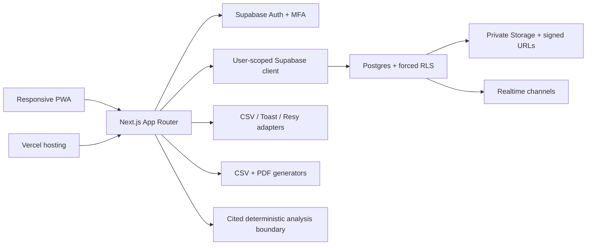

# Le Yard OS

Le Yard OS is a mobile-first, multi-tenant restaurant back-office application. It brings scheduling, team communication, vendor purchasing, closeouts, tip pooling, receipts, inventory, guest CRM, tasks, reporting, integrations, and guarded operational intelligence into one workspace.

The repository is intentionally isolated from the existing `le-yard` public website. Demo mode uses synthetic people, transactions, documents, job codes, and operational activity. The Ninth Avenue address shown in the playground was supplied by the owner; it does not make the surrounding demo records real restaurant data.

## Delivery status

The codebase is a production-oriented release candidate with both a synthetic demo and tenant-scoped connected surfaces. The interface, database model, RLS policies, deterministic tip engine, CSV/PDF exports, PWA shell, authentication paths, private-file boundaries, realtime subscriptions, and guarded workflows are implemented. Connected mode is fail-safe: it never substitutes synthetic operational records, and controls remain visibly locked whenever their atomic database workflow or required owner policy is unavailable.

An owner-approved Vercel Production playground can expose the synthetic demo at a stable public URL behind a temporary two-Owner application sign-in. "Production" here describes Vercel's hosting channel only: this remains a resettable product playground, not the restaurant's live back office. It is deliberately separate from Supabase Auth and from the public restaurant website. A new isolated Supabase project could not be created because the connected account already has two active projects at its free-project limit; those unrelated projects were not modified. Live production bootstrap remains intentionally blocked until the owners provide and approve:

- Donald's and Maris's real owner emails
- restaurant organization name, any additional location details, timezone, and branding beyond the owner-supplied address
- final labor, break, overtime, tip, payroll-export, and retention policies
- an isolated Supabase project with available capacity
- approved integration credentials
- explicit authorization to deploy and connect the live back office (the current authorization covers only the synthetic Vercel Production playground)

See [Known limitations](docs/known-limitations.md) for the precise boundary between the local release candidate and production operation.

## Hosted playground boundary

- The displayed physical address is the owner-supplied `858 9th Ave, New York, NY 10019`.
- All staff, job codes, schedules, conversations, receipts, inventory, guest, financial, and report content is synthetic. Playground edits reset and are not shared or persisted as restaurant records.
- The two temporary identities are playground-only Owner principals, not Supabase production accounts. Passwords are represented only by server-side salted scrypt hashes; plaintext passwords must never enter source control, Vercel variables, logs, or support messages.
- An eight-hour signed, `HttpOnly`, `Secure` cookie carries the playground session. This convenience gate is not a substitute for Supabase Auth, MFA, production invitations, RLS, or the production Owner bootstrap.
- The Vercel Production URL is public and must be treated as discoverable. Workspace content still requires the application-level two-Owner login, and unauthenticated requests fail closed. Do not rely on URL secrecy as a security control.
- Login throttling is best-effort and per compute instance. The playground remains limited to the two owners; broader testing requires Vercel Deployment Protection or an approved durable shared rate limiter.
- Hosted mode must match the Vercel target exactly: `preview` only with `VERCEL_ENV=preview`, or `production-playground` only with `VERCEL_ENV=production`. Any mismatch or incomplete server-only configuration must fail closed.
- No SMTP, monitoring destination, OpenAI key, external AI provider, or OCR provider is configured. Payroll export requirements are undecided.
- The displayed break, overtime, gratuity, and event-fee values are unpublished owner assumptions for interface testing. They do not calculate or certify labor-law, tax, tip, or payroll compliance.

## Product surfaces

- Today: live service status, staffing, approvals, tasks, closeout, and inventory signals
- Team: profiles, roles, locations, availability, time off, certifications, private fields, documents, invitations, and suspension controls
- Schedule: reusable weekly surface, drag-and-drop changes, publish, acknowledgement, open shifts, and swap context
- Messages: all-staff, location, and management channels with unread state, reactions, attachments, announcements, and read state
- Vendors & purchasing: vendor contacts, current food prices, open orders, and price context for kitchen planning
- Closeout and tips: sales/cash reconciliation, attachments, approval lock, versioned tip rules, cent-safe distribution, explanations, and payroll CSV
- Receipts: private upload/review surface, paginated search, stored extraction evidence, duplicate decisions, and approved expense/delivery links
- Inventory: catalog, units, vendors, counts, purchasing, transfers, waste, price history, recipe costing, and variance signals
- Guests: unified CRM, visits, spend, preferences, allergies, VIP, consent, reservations, deduplication, and export
- Tasks and SOPs: assignments, versioned checklist/SOP authoring and publishing, photo evidence, acknowledgement, maintenance, and incident records
- Reports: 14 operational report types with location/date filters plus real CSV and PDF output
- Integrations: adapter registry, manual CSV import, sync attempts, retry state, and server-only credential boundary
- Ask Le Yard: deterministic tenant-record search in connected mode, with citations, confidence, and mandatory human approval boundaries; external model calls are not part of this release
- Settings: live organization, locations, role boundaries, MFA assurance, notification preferences, encrypted push-subscription custody, audit, export history, retention, backup evidence, and monitoring state

## Architecture



The tenant hierarchy is `organization -> locations`. Every public tenant table carries `organization_id`; location-owned records also carry or inherit `location_id`. RLS, composite foreign keys, application permissions, and signed storage paths all enforce that boundary.

## Local quick start

Requirements:

- Node.js 22 or 24
- npm 10 or newer
- Docker-compatible runtime only if running the local Supabase stack

```bash
npm ci
cp .env.example .env.local
npm run dev
```

Open [http://localhost:3000](http://localhost:3000). `NEXT_PUBLIC_DEMO_MODE=true` keeps the app on synthetic in-memory data and does not require Supabase credentials.

Runtime mode and application origin never default silently. If `.env.local` is missing or incomplete, the proxy serves a generic `503` instead of opening a demo or connected workspace. The committed `.env.test` contains synthetic-only values for deterministic unit tests; it contains no credentials. A production runtime rejects an open demo even if a local flag was copied accidentally; the only guarded Vercel Production exception is the complete two-Owner configuration with `LE_YARD_PLAYGROUND_MODE=production-playground` and the platform-supplied `VERCEL_ENV=production`.

The verified development and production-build scripts use Next.js with webpack. This shared parent workspace contains multiple lockfiles, so `next.config.ts` pins output tracing to this project directory; a standalone installation may reevaluate Turbopack separately.

## Local Supabase

With Docker running:

```bash
npx supabase start
npx supabase db reset
npx supabase test db tests/rls --local
npx supabase db lint --local --schema public --level error --fail-on error
```

Then copy the local API URL, publishable key, and secret key printed by the CLI into `.env.local`, and set `NEXT_PUBLIC_DEMO_MODE=false`.

After changing an ordered SQL migration, refresh the checked-in Supabase contract with `npm run types:database`. The generator applies the full migration chain in an isolated PGlite database before introspecting the public schema, so a migration that cannot be reproduced will fail instead of producing partial types. `npm run types:database:check` performs the same isolated generation in memory and fails on any byte-level drift without modifying the checked-in file.

Connected mode requires `NEXT_PUBLIC_SUPABASE_URL`, `NEXT_PUBLIC_SUPABASE_PUBLISHABLE_KEY`, and the server-only `SUPABASE_SECRET_KEY` as one complete set. Production connected deployments additionally reject HTTP or local application/Supabase origins.

Never run `supabase db reset`, the synthetic seed, or an unreviewed migration against a linked production project.

## Verification

Version 0.2 adds capability-backed operational authoring and service control. In connected mode, an effective Executive Chef job-role grant can author the kitchen catalog without receiving organization-security access. `/service` provides the internal realtime 86/running-low board, versioned Manager Log, and structured pre-shift acknowledgement flow. `/time-clock` is again a real connected route. These workflows remain tenant/location scoped and never substitute demo rows in connected mode.

```bash
npm run lint
npm run types:database:check
npm run typecheck
npm run test
npm run test:integration
npm run test:db:pglite
npm run test:rls
npm run test:e2e
npm run test:a11y
npm run build
```

`npm run verify` runs lint, the read-only generated-database-contract check, TypeScript, unit tests, the portable migration/catalog integration check, and the production build. `npm run verify:full` adds the desktop/mobile browser suite and dependency audit. Native pgTAP RLS tests remain separate because they require the local Supabase stack.

`npm run verify:connected` is the production-like release-candidate gate. It adds native Supabase RLS tests, database lint, and the separate connected Playwright project, which authenticates synthetic Owner/Admin/Manager/Employee fixtures against an approved nonproduction deployment. Its desktop/mobile core matrix is read-only and blocks unexpected write requests; the isolated Employee chat write probe is opt-in behind an exact nonproduction host, fixture, and run-id confirmation. The suite intentionally fails or skips truthfully when its preview inputs are absent.

The tip engine uses integer cents and minutes, deterministic largest-remainder allocation, stable tie-breaking, immutable approval locks, and formula-safe CSV export. It is payroll support, not a payroll processor.

## Security invariants

- Only Owner and Admin roles can create, invite, suspend, or assign roles to users.
- Owner administrative writes require Authenticator Assurance Level 2 in the database.
- Admins never create or retrieve an employee's existing password; invitees set their own.
- The final active Owner cannot be removed or demoted.
- Browser requests use a user JWT and remain subject to forced RLS.
- Supabase secret credentials are server-only and never use a `NEXT_PUBLIC_` prefix.
- Integration ciphertext lives in the unexposed `private` schema.
- Every storage bucket is private; files use short-lived signed access.
- Audit events and approved financial ledgers are immutable.
- AI output must cite records, display confidence, and cannot silently mutate payroll, tips, punches, inventory, or guests.
- Playground passwords are never stored in plaintext. The registry and session secret remain server-only and scoped to their Vercel target, and the signed session expires after eight hours.
- Playground Owner identities are not Supabase Auth identities and do not satisfy the live-production MFA requirement.
- Authentication return paths accept only normalized origin-relative paths; absolute, scheme-relative, backslash, encoded-control, and off-origin redirects are rejected.
- Connected CSV/PDF report exports use the authenticated tenant read model, refuse truncated evidence, and never substitute demo records. Raw whole-tenant/guest exports remain locked until an owner approves their destination and retention rule.
- Owner-supplied operating assumptions remain visibly draft until their timing, eligibility, accounting, payroll, and compliance details are approved. Retention is unset, so the app performs no policy-driven automatic deletion.

## Repository map

```text
src/app/                  App Router pages, server actions, and route handlers
src/components/           Product workspaces, shell, and UI primitives
src/data/                 Authenticated tenant data layer
src/lib/                  Domain logic, permissions, Supabase, exports, AI guards
src/types/                Shared domain contracts
supabase/migrations/      Forward-only schema, RLS, storage, integrity, and audit
supabase/seed.sql         Synthetic local-only tenant data
scripts/                  Portable schema, bootstrap, and security verifiers
tests/unit/               Permission, tip, report, AI, and data-layer tests
tests/rls/                Catalog and behavioral RLS proof
tests/e2e/                Desktop/mobile workflow and accessibility checks
tests/connected/          Guarded nonproduction Auth and tenant acceptance
docs/                     Operational and technical handoff
```

## Handoff documents

- [Database and relationship model](docs/database.md)
- [Permission matrix](docs/permission-matrix.md)
- [Environment variables](docs/environment.md)
- [Owner runbook](docs/owner-runbook.md)
- [Backup and restore process](docs/backups.md)
- [Integration framework](docs/integrations.md)
- [Inventory catalog configuration](docs/inventory-catalog.md)
- [Operations security configuration](docs/operations-security-configuration.md)
- [Known limitations](docs/known-limitations.md)

## Deployment boundary

The application is designed for Vercel and Supabase. The owners authorized a new, isolated, publicly reachable Vercel Production playground; they did not authorize changes to the existing public restaurant website or launch of a live back office. The playground remains login-gated, synthetic, resettable, and nonpersistent because a third free Supabase project is currently unavailable. Follow the live-production gate in the [owner runbook](docs/owner-runbook.md) only after the missing inputs, an isolated Supabase project, connected acceptance, and separate explicit live-production approval are present.
