# Le Yard OS — ultimate product and engineering audit

> **Implementation follow-through:** the audit below records the original 2026-08-09 snapshot. See the [2026-08-10 implementation status](IMPLEMENTATION-STATUS.md) for the current gate matrix, exact-byte verification, and unresolved release dependencies after the reservation-safety and first action-system delivery slices.

- Audit date: 2026-08-09
- Primary repository: `le-yard-os`
- Public booking repository: `le-yard`
- Branch observed: `codex/le-yard-os-v0-2-operational-authoring`
- Audit type: combined UX, accessibility, architecture, security, and delivery-planning audit
- Target: WCAG 2.2 Level AA, with a 44–48 CSS px operational touch-target baseline

## Executive verdict

Le Yard OS is already a serious restaurant platform. Its tenant model, forced RLS, capability framework, immutable financial boundaries, fail-closed runtime configuration, portable database verification, and honest connected/demo separation are stronger than the average early-stage back-office product.

It is not yet the ultimate restaurant operating system because the experience is still organized around **destinations** instead of **the next operational action**. The Owner demo exposes 20 workspace destinations. The desktop `Create` control opens a workspace navigator rather than creation actions. On mobile, Today has no primary action or search entry, while daily actions such as Time Clock and Service Control sit behind More for some roles. The product has breadth; it now needs orchestration.

The in-progress first-party reservation system is promising and unusually complete for its age, but it must remain launch-disabled. Five safety issues are release blockers: Host-role RLS mismatch, bypassable guest verification, expired holds that continue to consume pacing, no hard database invariant against overlapping table allocations, and no safe cutover while another reservation channel remains independently writable.

The product thesis for the next release should be:

> **Le Yard OS tells each person what needs attention now, makes the safest next action one tap away, and preserves a trustworthy operational record when the network, provider, or human workflow fails.**

## Health summary

| Area                                   | Health         | Audit conclusion                                                                                                                    |
| -------------------------------------- | -------------- | ----------------------------------------------------------------------------------------------------------------------------------- |
| Tenant, RLS, and database security     | Strong         | Keep the modular monolith and database-authoritative workflow boundary.                                                             |
| Test and verification foundation       | Strong         | Broad unit/integration coverage exists; add dynamic, concurrent, role-specific, and failure-state coverage.                         |
| Visual system                          | Strong         | Warm, legible, distinctive, and generally responsive. Reuse it rather than redesigning the brand.                                   |
| Action hierarchy                       | Needs redesign | Today, mobile navigation, and command search do not yet form one role-aware action system.                                          |
| Accessibility foundation               | Mixed          | Strong focus/reduced-motion/button primitives exist, but many modules bypass them.                                                  |
| Mobile operations                      | Mixed          | Large controls and safe-area handling are common, but important actions are hidden and dense modules need alternate views.          |
| Reservation staff and guest UX         | Promising      | Coherent day book, floor, waitlist, and public booking entry; launch safety is not yet sufficient.                                  |
| Realtime/offline resilience            | Incomplete     | Safe network-only caching exists, but there is no limited mutation outbox, consistent reconnect state, or conflict model.           |
| Observability and production readiness | Blocked        | No production-like isolated Supabase environment, structured operational telemetry, provider acceptance, or full dependency health. |

## Audit scope and method

This audit covered:

- the Le Yard OS shell, Today, mobile navigation, Service Control, reservations, reservation setup, and staff booking dialog;
- the public Le Yard guest booking entry and validation state;
- role/capability navigation, workflow/data boundaries, RLS and migrations, realtime/offline behavior, observability, tests, and delivery documentation;
- the complete uncommitted reservation foundation in both repositories;
- current accessibility and interaction guidance from W3C/WAI, Apple, Android, USWDS, GOV.UK, Chrome, and web.dev.

The product was run in synthetic demo mode. The public booking API was not connected to a production-like Supabase environment, so no real reservation was created and no guest data was transmitted. All screenshots below were captured and inspected during this audit.

## Numbered flow audit

### Step 1 — Owner Today on desktop

Health: **Mixed**

The visual hierarchy is calm, legible, and trustworthy. The opening viewport explains live-data readiness and surfaces staffing. However, the strongest content is descriptive rather than actionable: four primary metrics are empty, “Needs action” is empty, and the only visible contextual link is Vendors. Today behaves like a dashboard, not the service-day control plane.

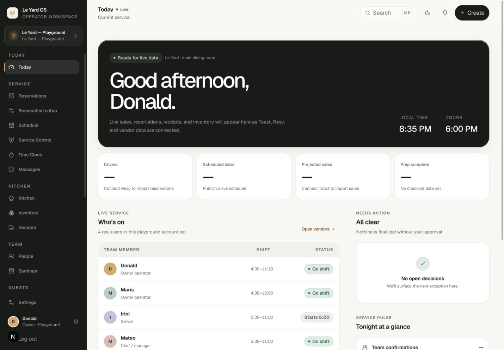

### Step 2 — Desktop Create / command menu

Health: **Needs redesign**

The dialog opens with focus in search and is visually clear. Its promise is inaccurate: `Create` and “search actions” produce a list of workspaces only. There are no Create, Find, Recent, or contextual action groups, and no guest, reservation, table, shift, task, item, or approval results.

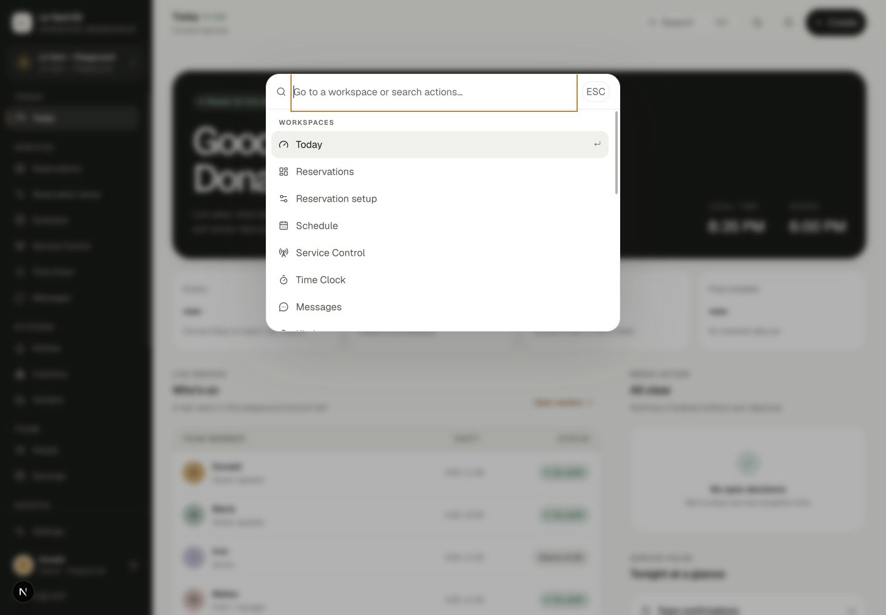

### Step 3 — Reservation host stand on desktop

Health: **Promising, with a blocking layout defect**

The day book, floor, pacing, waitlist, and top actions form a coherent host surface. Statuses are scannable and `Book` / `Waitlist` are appropriately prominent. At a 1440 px viewport the document measured 1548 px wide, creating 108 px of page-level horizontal overflow and clipping the right-side context panel. A spatial floor may scroll internally; the entire operating surface should not.

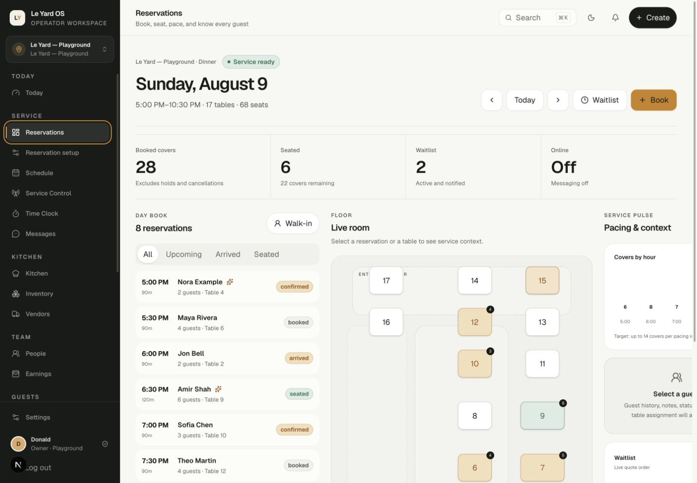

### Step 4 — Selected reservation and guest context

Health: **Mixed**

Selecting a guest reveals useful hospitality context and status actions without changing routes. The right panel is partially outside the 1440 px viewport, making Share, table suggestion, Arrive, No-show, and waitlist context harder to use. The staff model also conflates current table state with all-day future allocation; “floor now” and future interval availability need separate projections.

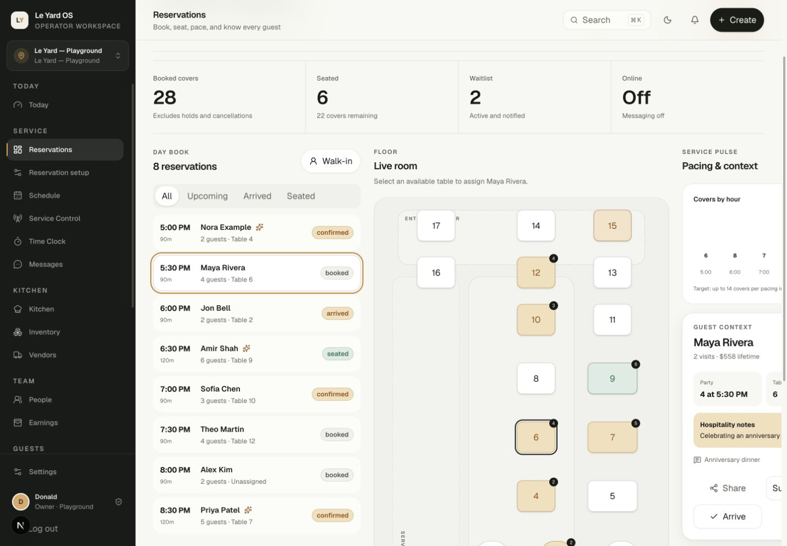

### Step 5 — Staff-created reservation

Health: **Promising**

The form is concise and keeps guest, party, timing, and notes together. The final source snapshot added an `aria-labelledby` name after this screenshot was captured, but the dialog still needs the complete shared modal contract used by Inventory: an initial-focus policy, Tab containment, Escape, outside inerting, and deterministic focus return. Staff cancellation, modification, restore, explicit override, and service-shift exception flows are not yet complete.

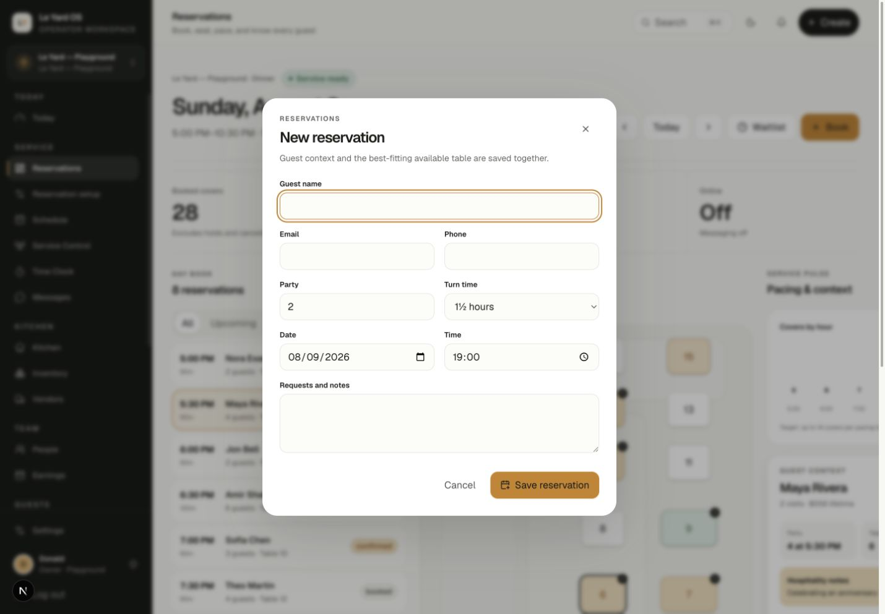

### Step 6 — Reservation host stand on mobile

Health: **Good entry, too tall for rapid service**

The primary actions remain above the fold and the 390 px view has no page-level horizontal overflow. The four filter chips are 36 px tall: they meet WCAG 2.2's 24 px minimum but miss the product target of 44–48 px for repeated service controls. Day book, floor, guest detail, pacing, and waitlist become one 3,228 px stack; mobile needs task-specific list/detail modes rather than a desktop information architecture in one column.

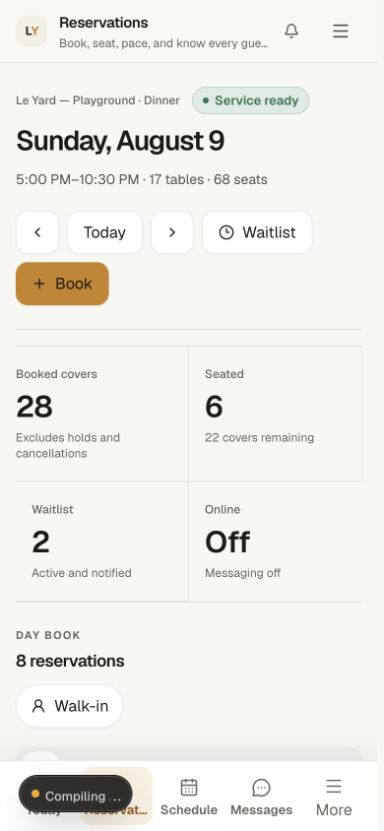

### Step 7 — Mobile More navigation

Health: **Needs redesign**

The drawer is well styled, uses large targets, and clearly groups modules. It is also a long second-level map whose first viewport ends after Kitchen. Important daily actions change from one tap to two taps based on a hard-coded role list. Keep four stable work-mode destinations plus More, and put the changing “Now” action on Today rather than reshuffling navigation during a shift.

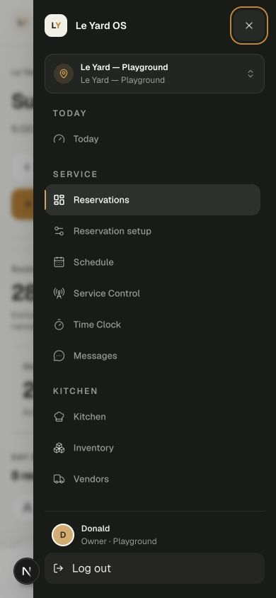

### Step 8 — Public booking entry on desktop

Health: **Strong visual entry**

The guest path is focused, branded, and avoids account creation. Party and date precede availability, the primary action is unambiguous, and large-party guidance is visible. The visual experience should be retained while the verification and inventory-safety model is rebuilt.

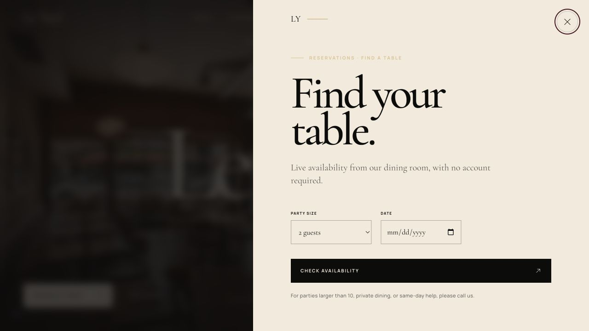

### Step 9 — Public booking entry on mobile

Health: **Strong**

The mobile panel reflows cleanly at 390 px, keeps controls large, and preserves a single primary action. The close control receives initial focus. The remaining work is primarily domain safety, end-to-end error recovery, privacy/consent, and production support contact—not visual reinvention.

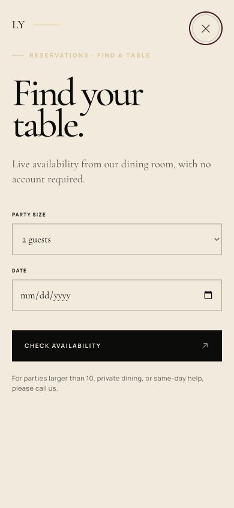

### Step 10 — Public booking validation

Health: **Good basic recovery**

Submitting without a date produces a visible `role="alert"` message above the relevant inputs. Add field-level association, keep the user's valid entries during server failures, and distinguish invalid input, no inventory, rate limiting, provider failure, and temporary service outage.

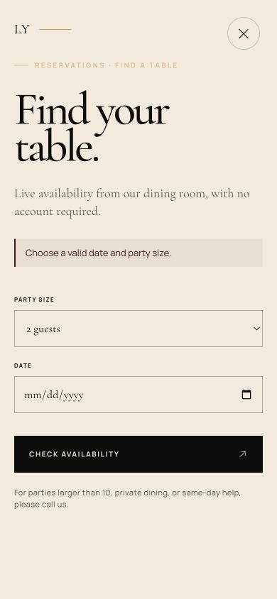

### Step 11 — Today on mobile

Health: **Needs redesign**

The hero and metrics are legible and there is no horizontal overflow. The entire first viewport is informational. Search and Create disappear, and no role-aware primary action replaces them. For a service OS, the first screen should answer “what should I do now?” before it explains the product or integrations.

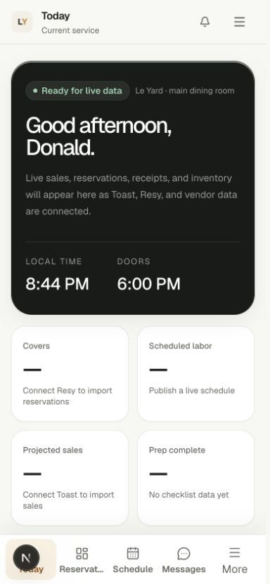

### Step 12 — Service Control on mobile

Health: **Mixed**

The visible controls measured at least 44 px and the first operational action is prominent. The page duplicates the title in a large hero and then exposes long authoring forms. Several selects and numeric inputs have no explicit accessible names in the rendered tree. Make the live operating picture primary and open `Update 86`, `Add handoff`, and `Publish pre-shift` as focused tasks using a shared `FormField` contract.

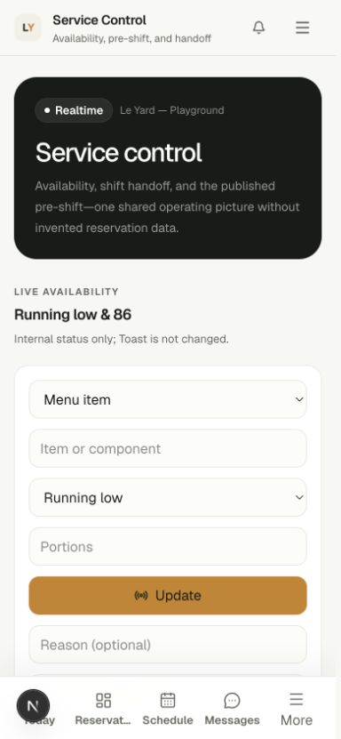

### Step 13 — Reservation activation and physical-room approval

Health: **Strong safety posture, ambiguous status language**

The system is off by default, separates draft installation from physical verification, and requires an audit note. That is the right operational posture. The top status says `Approved` while Public booking and Messaging are `Off` and the page still presents approval steps; use explicit lifecycle labels such as Draft, Floor verified, Staff enabled, Public enabled, and Delivery verified.

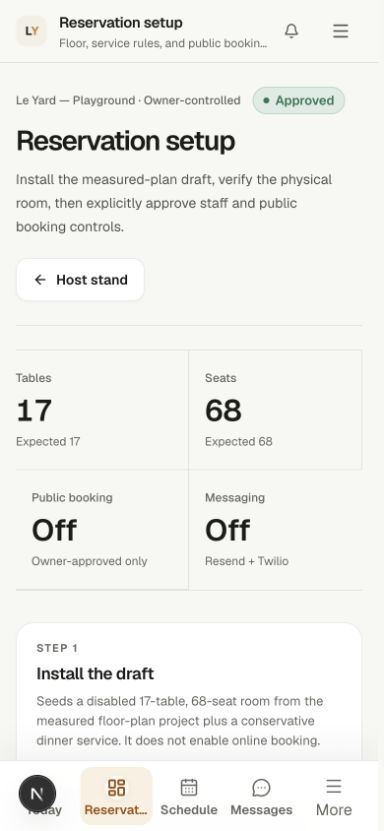

## Highest-priority findings

### P0 — must be resolved before a connected pilot

1. **Fix Host-role reservation reads.** Host/Hostess defaults receive `reservations.view` and `reservations.operate`, and the route is visible, but legacy RLS for `reservations` and `guests` still requires management. A normal Host can be routed into a workspace whose read model fails. Align RLS with exact capabilities and test Owner, Manager, Host, view-only, operate-only, and cross-location users.

2. **Make guest verification real.** The browser currently generates and retains the confirmation token and can immediately use it. Generate verification material server-side and release it only through the email/SMS channel. The browser should receive an opaque hold ID and a “check your email/text” state.

3. **Expire holds as a first-class state.** Expired allocations stop blocking a table, but `pending_verification` reservations continue to count against pacing. Add an atomic expiry workflow and count only confirmed reservations plus unexpired holds in both read-time and database pacing checks.

4. **Add a hard allocation invariant.** The overlap check is application/database-function logic backed by a normal index, not a PostgreSQL exclusion constraint or equivalent locked invariant. Add a range-based exclusion constraint or an exact-table locking strategy with a fresh post-lock check, then prove it with two-connection concurrency tests.

5. **Choose one reservation writer before cutover.** OS availability does not synchronously include independently writable Resy/OpenTable/phone inventory. Run a shadow period, reconcile, and then stop the incumbent writer or implement an explicit conflict protocol before public booking accepts live inventory.

6. **Unify capability policy between the application and database.** Some workflows first require a managed location even when the exact database capability is grantable to an employee. This can make valid capability paths unreachable. Use application checks for tenant/location membership plus the precise capability, with PostgreSQL authoritative.

### P1 — build the operating layer

1. **Create a shared, permission-aware Action Registry.** Today, the mobile dock, contextual toolbars, and command search should consume the same typed registry. Each action defines role/capability, location, service phase, prerequisites, urgency, reversibility, route/dialog, analytics name, and offline policy.

2. **Turn Today into the “Now” surface.** Show one dominant action, a short exception queue, and source freshness. Reservations should contribute next arrivals, waiting/notified guests, late/no-show risk, unassigned parties, and blocked/dirty tables.

3. **Make the mobile dock stable by work mode.** Do not reshuffle it during service. Let the dynamic primary action live on Today and allow one user-pinned slot only after usage evidence exists.

4. **Replace route-heavy reads with consolidated operational snapshots.** Today currently performs many sequential reads and then separately loads Service Control. Introduce a tenant/location/role-scoped service-day snapshot or exception-feed contract with freshness and source metadata.

5. **Move multi-record writes into transactional RPCs.** Schedule/template parent-child writes currently rely on compensating cleanup and concurrency-sensitive version selection. Use atomic commands with stable request IDs, payload hashes, replay behavior, and fault/concurrency tests.

6. **Standardize Modal, Drawer, Popover, FormField, IconAction, Tabs, and state components.** Inventory's modal is the reference. Time Clock, Schedule, Reservations, Notifications, Messages, and Service Control need to consume the same accessibility contracts.

7. **Separate reservation “floor now” from future inventory.** Current room state, active occupation/reset/block state, and proposed future allocations are different projections. Model and render them separately.

8. **Add structured operational observability.** Carry correlation and operation IDs through actions, RPCs, logs, notifications, and audit events. Record redacted failure class, latency, realtime state, provider state, data age, and sync freshness.

9. **Define a limited offline matrix.** Keep finance, approvals, sensitive PII, and destructive changes online-only. Consider an idempotent local outbox only for approved append-only tasks such as a checklist tick, draft note, or count entry, with explicit Pending → Syncing → Synced / Needs attention states.

### P2 — reduce complexity and finish the interaction system

- Make the command menu a true omnibox with Navigate, Create, Find, Recent, and contextual action groups plus full Arrow/Home/End semantics.
- Add responsive list/card/agenda alternatives for the reservation floor, schedule, inventory tables, and closeout allocations.
- Reorganize Tasks into My work, Report, and Manage instead of five peer authoring domains.
- Add message-log semantics, selected channel semantics, restrained live announcements, and 44 px reaction targets.
- Unify demo/live presentation through data adapters and extract oversized route modules by bounded use case.
- Resolve MFA documentation drift and use step-up authentication for high-risk account, policy, financial, export, and retention changes.

## Target interaction architecture

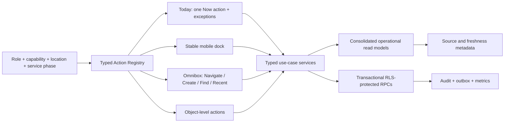

Keep the backend as a **modular monolith** with five bounded contexts:

1. Service Day — Today, reservations, guests, Service Control, schedule, time, tasks, and operational messaging.
2. Supply — kitchen, menu/recipes, inventory, vendors, purchasing, receiving, counts, and waste.
3. People — profiles, roles/capabilities, availability, certifications, and private records.
4. Finance — closeout, tips, receipts/invoices, earnings, exports, and retention controls.
5. Platform — auth, tenancy, integrations, files, notifications, audit, observability, and guarded intelligence.

Do not split these into network microservices now. The consistency, RLS, audit, and transaction requirements benefit from one deployable and one Postgres boundary.

## Role-aware navigation and Now actions

| Work mode         | Stable mobile destinations                          | Examples of the changing Now action                                         |
| ----------------- | --------------------------------------------------- | --------------------------------------------------------------------------- |
| Owner/Admin       | Today · Closeout · Reports/Approvals · Inbox · More | Submit/approve closeout, approve tips, resolve a critical setup exception   |
| GM/Manager        | Today · Service · Schedule · Inbox · More           | Publish pre-shift, resolve coverage, approve a correction, close a handoff  |
| Host/Service lead | Today · Reservations · Guests · Inbox · More        | Book/walk-in, seat next party, notify waitlist, resolve an unassigned party |
| FOH staff         | Today · Time Clock · Schedule · Inbox · More        | Clock in/out, start/end break, acknowledge pre-shift, claim shift           |
| Chef/BOH lead     | Today · Kitchen · Inventory · Inbox · More          | 86/restore, start count, receive order, publish prep context                |
| BOH staff         | Today · Time Clock · Kitchen/Tasks · Inbox · More   | Clock in, start checklist, mark prep complete, record waste                 |

Derive work mode from active job assignment plus effective capabilities. Do not add a growing set of hard-coded persona flags.

## Reservation target domain

The reservation foundation should separate provisional, operational, and identity states:

- `booking_hold`: opaque public offer, provisional contact, service-shift version, party, interval, expiry, verification state, and abuse attributes;
- `reservation`: confirmed commitment only; `confirmed → arrived → seated → completed`, with terminal `cancelled` and `no_show`;
- `reservation_revision`: immutable modification and applied policy/rule version;
- `inventory_allocation`: tentative/committed/block interval with hard overlap protection and explicit release/expiry;
- `service_shift`: materialized business-date service with exceptions, closures, buyouts, buffers, pacing, and version;
- `guest_contact_claim`: normalized unverified/verified/revoked email or phone, merged into CRM only after verification;
- `waitlist_entry`: `waiting → offered → accepted → seated`, with expired/cancelled terminals;
- `message_outbox`: every verification, confirmation, reminder, modification, cancellation, and waitlist message with leases, retry, provider ID, and delivery evidence;
- `source_binding`: external source, external ID/version, last sync, field ownership, and conflict state.

Exchange confirmation/manage tokens once into an HttpOnly same-origin session and remove secrets from URLs immediately.

## Accessibility and performance baseline

The target is [WCAG 2.2 Level AA](https://www.w3.org/TR/WCAG22/), with higher operational product targets where practical:

- 48×48 CSS px for primary/repeated touch controls; WCAG's normative minimum is [24×24 CSS px](https://www.w3.org/TR/WCAG22/#target-size-minimum), while Apple and Android recommend larger platform targets.
- No focused control hidden by sticky headers, bottom navigation, toasts, or panels; see [Focus Not Obscured](https://www.w3.org/TR/WCAG22/#focus-not-obscured-minimum).
- No loss of information or page-level two-dimensional scrolling at the equivalent of 320 CSS px; see [Reflow](https://www.w3.org/TR/WCAG22/#reflow).
- Programmatic save/sync/result/error announcements under [Status Messages](https://www.w3.org/TR/WCAG22/#status-messages).
- Dialogs, tabs, menus, and comboboxes follow the [WAI-ARIA Authoring Practices](https://www.w3.org/WAI/ARIA/apg/patterns/).
- At the 75th percentile of real visits, LCP ≤ 2.5 s, INP ≤ 200 ms, and CLS ≤ 0.1; see [web.dev Web Vitals](https://web.dev/articles/vitals).

Measured evidence in this run:

- the Playwright axe gate passed 20/20 desktop/mobile checks on ten initial route states;
- after that run, the moving worktree added Reservations and Reservation setup to the axe route matrix and introduced a reservation dialog/overflow E2E spec; those late additions were inspected but not rerun as part of this audit;
- the passed run still omits Service Control, Time Clock, Tasks, auth/settings, open dialogs/drawers, errors, dark theme, zoom/reflow, dynamic announcements, and populated states;
- the reservation desktop produced 1548 px of document width in a 1440 px viewport;
- reservation filter chips were 36 px tall on mobile;
- all visible controls in the captured Service Control mobile viewport were at least 44 px;
- the dark `ink-faint` / `paper-strong` token pair is approximately 4.24:1 for normal text, below the 4.5:1 AA threshold;
- the shell has a `<main>` landmark but no skip link.

## Product measurement plan

Instrument privacy-safe events with work mode, capability bundle, viewport, route, service phase, duration, outcome, and data freshness—never guest text, message text, or raw search terms.

Track:

- time and interaction count to clock in, arrive/seat, post 86, publish/acknowledge pre-shift, count stock, and submit/approve closeout;
- backtracks, More opens, validation failure, retry, abandonment, and pending action age;
- command-search open → result → completed action and zero-result rate;
- realtime lag, reconnect duration, offline retry state, duplicate-replay protection, and provider delivery age;
- keyboard completion, focus escape/return, hidden focus, touch-target misses, axe results by state/theme/viewport, and contrast-token tests.

Initial success targets after collecting a baseline:

- 90% of each work mode's top three tasks reachable within one tap from Today or the mobile dock;
- 30% fewer interactions and 25% faster median completion for the five most common workflows;
- zero sub-44 px primary or repeatedly used service controls;
- 100% keyboard completion of the same critical workflows;
- no serious/critical axe findings across key routes **and their open, error, empty, loading, and dark-theme states**.

Validate with contextual service-phase sessions: 5–7 staff, host, manager, and kitchen participants per work mode, including keyboard-only and screen-reader users. Pair the study with a two-week product-event baseline.

## Delivery roadmap

### Days 0–30 — safety and the service-day spine

- Keep public reservations disabled and fix all reservation P0s.
- Align application policy with exact capabilities and add role × grant × deny × location × effective-date tests.
- Build the shared Action Registry and role-aware Today `Now` / exception contract.
- Add reservation exceptions to Today without duplicating the host stand.
- Create the core Modal, Drawer, FormField, IconAction, Tabs, ReadState, and StickyActionBar primitives.
- Add correlation IDs, structured redacted logs, data-age/realtime state, and stable retry IDs.
- Split the active reservation work into reviewable foundation, public API/auth, delivery/push, and UI/setup changes.

### Days 31–60 — consolidated operations and resilient workflows

- Add the service-day snapshot/exception-feed contract.
- Convert multi-record schedule and operational writes to atomic RPCs.
- Separate current floor state from future reservation inventory and materialize service shifts/exceptions.
- Add coalesced realtime invalidation and explicit reconnect state.
- Add approved append-only offline outbox support with conflict/retry UX.
- Introduce responsive list/card/agenda modes and complete composite-widget keyboard semantics.

### Days 61–90 — production-like acceptance and staged pilot

- Provision an isolated production-like Supabase environment.
- Validate Auth/RLS/Realtime, email/SMS/push, cron, monitoring, backup/PITR, secret rotation, and restore drills.
- Run reservation shadow inventory and reconciliation before selecting the single writer.
- Pilot one location and representative service with kill switches and rollback runbooks.
- Release a limited public inventory tranche only after delivery, concurrency, abuse, privacy/consent, cancellation, and reconciliation acceptance.
- Promote only after owner signoff and observed service metrics meet the release gates.

## Best use of the next 3.5 hours

Do not spend the first implementation window on cosmetic polish. Use it to turn the reservation blockers into executable proof:

1. **0:00–0:30 — freeze and write failing contracts:** Host RLS read, server-owned verification, expired-hold pacing, and competing allocation tests.
2. **0:30–1:15 — repair Host read authorization:** exact capability/location RLS plus positive/negative role tests.
3. **1:15–2:00 — redesign verification:** server-generated OTP/link exchange and transactional outbox enqueue; remove browser-owned confirmation secrets.
4. **2:00–2:45 — add hold expiry semantics:** explicit expired state, expiry worker/command, pacing exclusions, replay and abuse tests.
5. **2:45–3:15 — establish the overlap invariant:** migration and two-connection test harness; finish or leave a truthful failing gate rather than a soft assertion.
6. **3:15–3:30 — run focused verification and record the remaining launch gate.**

The next implementation slice should then build the Action Registry and one vertical Today flow rather than touching every module at once.

## Model and compute choice

This audit used **GPT-5.6-sol at xhigh reasoning** for parallel architecture, reservation, UX/accessibility, and current-standards work, followed by a single synthesis pass. That is the right model/effort for security-sensitive migrations, concurrency, architecture boundaries, and final review.

For delivery:

- use GPT-5.6-sol xhigh for reservation state/concurrency, RLS, transactional RPCs, threat review, and release gates;
- use GPT-5.6-terra high for bounded UI primitives, tests, mechanical refactors, and documentation after the target contract is settled;
- return to GPT-5.6-sol for cross-context review and acceptance.

Subscription dollar limits do not map reliably to auditable token counts in this workspace, and the agent cannot see the account's weekly meter. Optimize for verified increments and evidence, not quota consumption.

## Verification performed

- `npm run lint` — passed.
- `npm run typecheck` — passed.
- Unit suite observed by the architecture track — 78 files / 440 tests passed.
- Portable integration verification — passed; 135/135 public tables force RLS and 222 public functions were governed in the audited reservation worktree.
- Production build — passed.
- Reservation-focused TypeScript, 19 unit/security tests, PGlite reservation verification, function-grant verification, and public-site reservation lint — passed.
- `npm run test:a11y` — 20/20 desktop/mobile checks passed before the late reservation-route additions described above.
- Captured local OS and public-site flows reported no browser console errors.

Passing tests do **not** clear the launch blockers. Missing proof includes real two-connection reservation concurrency, hold/message expiry and crash recovery, Host-role connected reads, true public-site-to-OS browser/API integration, provider delivery, dark-theme and dynamic-state accessibility, screen-reader use, 320 px/400% reflow, offline/reconnect, and physical-floor acceptance.

## Evidence limits and repository state

- The worktree was actively changing during this audit. Reservation documentation and related files appeared while review was in progress. Findings describe the audited snapshot and should be rechecked after the work is split or committed.
- The flow ran against synthetic demo data; no production-like Supabase project was available.
- No real reservation, message, punch, task, inventory, financial, or provider record was created.
- Screenshots establish visible structure and behavior, not complete WCAG conformance.
- No screen-reader, physical-device, slow-network, offline, provider, backup, or production-load test was performed.

## Decision summary

1. Keep the visual system and modular-monolith foundation.
2. Keep online reservations off until all five P0 safety issues are proven closed.
3. Make the Action Registry + Today `Now` layer the product spine.
4. Stabilize the mobile dock by work mode; move context changes into Today.
5. Use one set of interaction/accessibility primitives across demo and connected surfaces.
6. Pilot in an isolated production-like environment with one reservation writer, explicit freshness, observable delivery, and rollback.
