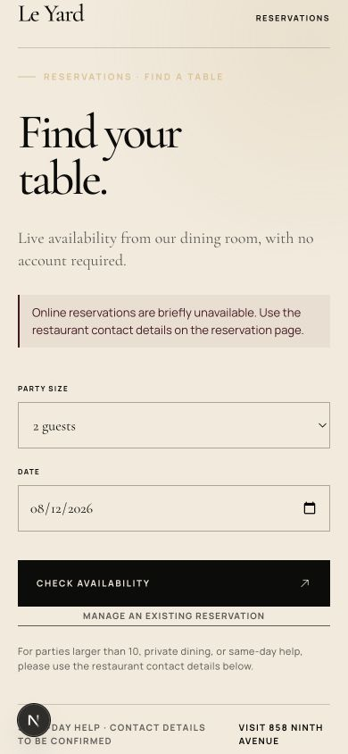
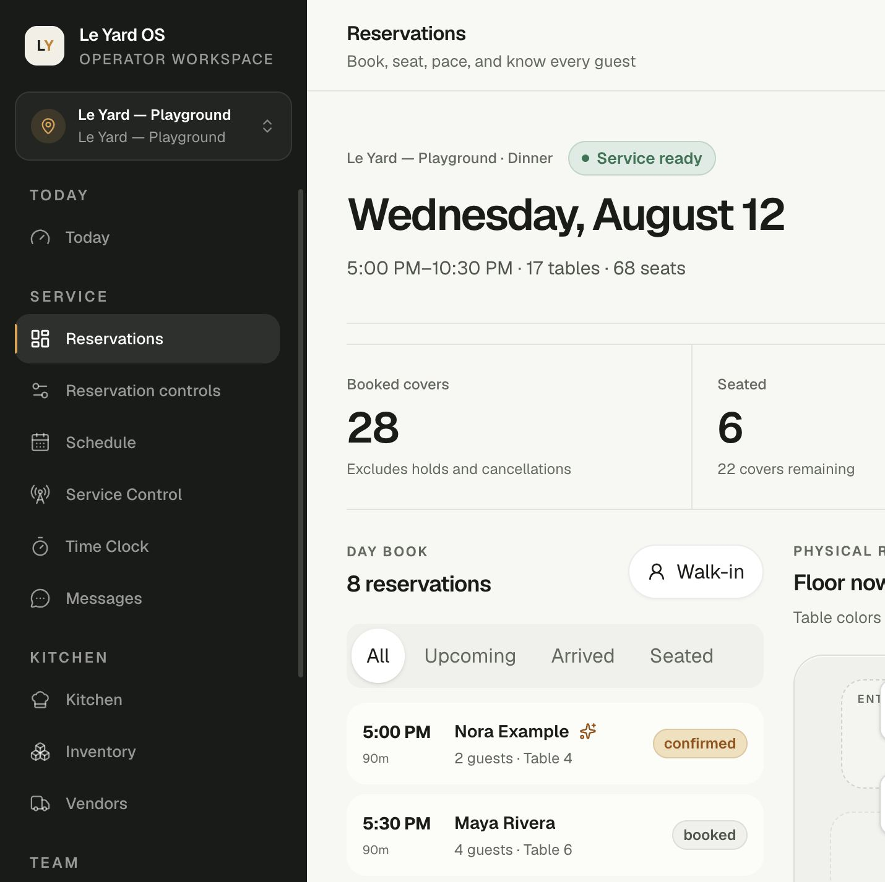
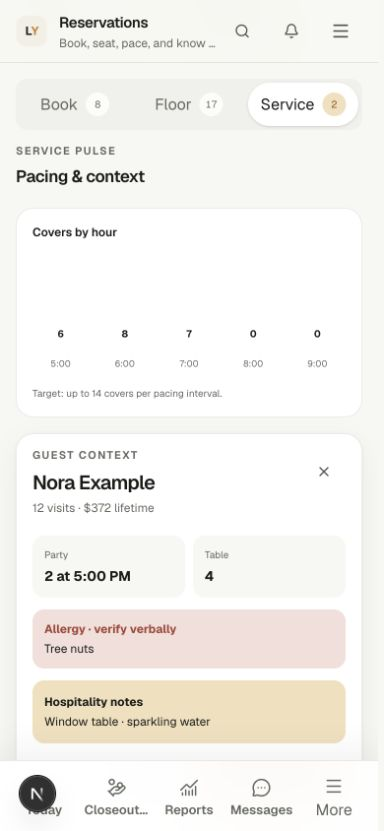
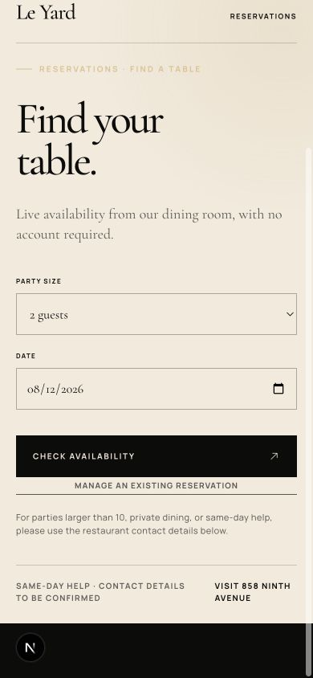

# Le Yard OS and reservations deep bug audit

- Evidence date: 2026-08-12
- Scope: the current dirty worktrees of `le-yard-os` and `le-yard`
- Method: code and migration review, reservation contract tracing, desktop/mobile browser exercise, repository test gates, production builds, and release-runbook review
- Change policy: audit followed by targeted local remediation and regression verification.

## Executive verdict

The reservation integrity core is materially stronger than the historical August 9 audit: confirmed commitments and unexpired holds feed pacing, active table intervals have a PostgreSQL GiST exclusion constraint, public verification and management capabilities stay behind the BFF/HttpOnly boundary, Host data is capability-scoped, and the walk-in fallback is restricted to the exact `23P01` case.

All repository-controlled P0/P1 defects identified below have now been repaired locally. The worktree is still **not production-activation-ready**: connected Supabase, native concurrency, provider, physical-room, one-writer, backup, and pilot evidence remain external release gates.

## Remediation status

| Finding | Current state | Verification |
| --- | --- | --- |
| Toast sync-status RPC grant | Resolved: explicitly reviewed for authenticated callers; same-location access retained | Function-grant and full integration suites pass; same-location, unassigned-location, and cross-tenant cases pass |
| Playwright readiness deadlock | Resolved: test-server liveness uses `/sign-in`; production health remains fail-closed | Reservation browser matrix passes 6/6 on desktop and mobile |
| Public missing-contact dead end | Resolved: one canonical helper emits a real phone/email action or a truthful retry-later message | Public tests pass 12/12; lint, TypeScript, and build pass |
| Demo Host false-success branches | Resolved: demo commands now update the local reservation/floor/waitlist model | Focused component tests cover reservation, table, and waitlist mutations |
| Ordinary seated reassignment | Resolved: blocked in both the UI and database; an atomic move remains a separate future workflow | Reservation PGlite suite proves SQLSTATE `23514` |
| Implicit floor assignment | Resolved: floor clicks inspect by default and mutate only inside explicit assignment mode | Focused interaction tests and browser matrix pass |
| Silent immediate delivery trigger | Resolved: accepted, rejected, transport, and missing-secret outcomes are redacted and test-covered | Focused unit tests pass |
| Connected public guest journey | Open release-evidence gate, not a repaired local substitute | Requires disposable connected infrastructure and captured provider delivery |

## Severity model

- **P0 release stop:** do not merge/deploy or enable the affected surface until resolved.
- **P1 operational correctness:** can strand a guest, mislead a host, or erase release confidence.
- **P2 interaction/observability:** does not weaken the database invariant, but increases mistakes or recovery time.

## Audit-time findings and closure

### Resolved P0 — the authenticated function-grant allowlist was red

`npm run test:function-grants:pglite` and the full `npm run test:integration` both fail because `get_pos_labor_sync_status(uuid)` is a new authenticated `SECURITY DEFINER` function with `row_security=off`, but it is absent from the repository's explicit browser-RPC manifest.

Evidence:

- `supabase/migrations/20260813144236_toast_labor_time_entry_sync.sql:50-86` defines a fixed-column function guarded by `can_access_location`.
- The same migration grants it to `authenticated` at lines 378-379.
- `scripts/verify-function-grants-pglite.mjs:362-405` rejects every authenticated function outside the reviewed allowlist.
- The migration chain and 139/139 forced-RLS table check pass before the manifest gate stops the suite.

This was a release-boundary failure, not proof of a tenant escape: the function contains a same-location access check and returns only sync metadata. The function is now in the reviewed manifest, with same-location allow, unassigned-location deny, and cross-tenant deny behavior tests.

Surgical target:

1. Keep the fixed DTO and same-location guard.
2. Decide the contract: all same-location staff (recommended for a trustworthy read-only Toast attendance mirror) or an exact management capability.
3. Add the function to the reviewed manifest only with same-location allow and cross-location/denied-role tests.
4. If management-only, make the Time Clock read model tolerate hidden sync metadata instead of failing the entire attendance view.

### Resolved P1 — the reservation browser suite could not start its configured server

The default Playwright configuration waits for `http://127.0.0.1:3100/api/health`. The current health route deliberately returns 503 for a local demo because `runtime.playground` is false outside a validated hosted playground. Running `npx playwright test tests/e2e/reservations.spec.ts` therefore stops at web-server startup; none of the six desktop/mobile reservation cases executes.

Evidence:

- `playwright.config.ts:3-57` starts a demo `next dev` server but uses `/api/health` as the readiness URL.
- `src/app/api/health/route.ts:32-39` requires `runtime.playground` in demo mode.
- `src/lib/env.ts:172-193` makes `playground` true only for a validated production deployment.
- Direct observation of that exact server returned HTTP 503 with `liveness=ok` and `readiness=blocked`.

Closure: Playwright now waits on `/sign-in`, while the production readiness endpoint remains fail-closed. The existing reservation matrix passes 6/6 again.

### Resolved P1 — public booking failure sent guests to missing contact details

With the booking API unavailable, the public BFF returns: “Use the restaurant contact details on the reservation page.” The current page can simultaneously render “contact details to be confirmed” and no phone/email link. The tested guest has no recovery action.

Evidence:

- `le-yard/src/lib/booking-api.server.ts:234-261` emits the contact instruction for an unexpected booking failure.
- `le-yard/src/components/reservation-dialog.tsx:36-45` displays an upstream error message before its local phone/email-aware fallback.
- `le-yard/src/data/site-data.ts:21-22` allows both support fields to be absent.
- `le-yard/src/app/reserve/page.tsx:66-75` then shows no contact action.
- The mobile browser exercise reproduced the dead end with the booking API intentionally unconfigured.

Closure: `booking_unavailable` and the other public recovery states now use one canonical local support helper. It returns a real phone/email action when configured and a truthful retry-later message when neither exists. Requiring a verified support channel remains an activation-manifest gate.

### Resolved P1 — demo Host actions announced success without changing the model

The Playground is intended for evaluation and staff rehearsal, but several demo branches only set a success message and return. Reservation transitions, table assignment, physical table state, waitlist transitions, and waitlist seating remain visibly unchanged after the UI says they succeeded.

Evidence: `src/components/reservations/reservations-workspace.tsx:544-558`, `576-584`, `657-671`, `871-885`, and `912-942`.

Closure: demo success now updates the same in-memory reservation, allocation, physical-table, and waitlist model rendered by the workspace. Status, assignment, physical-table, waitlist-transition, and seating behavior is component-tested; demo remains offline and nonpersistent.

### Resolved P1 — seated table reassignment had no physical-floor transaction

At audit time, the database permitted `assign_reservation_tables` for any nonterminal reservation, including `seated`. The command changed interval allocations only. Physical occupancy was separately derived from `table_status_events`. The Host floor also turned every table click into an assignment whenever any reservation was selected.

For a seated party, a host could therefore reassign the reservation while the old table remained physically occupied and the new table remained physically available. This was persistent server state, not merely a refresh delay.

Evidence:

- `supabase/migrations/20260809231838_reservation_platform_foundation.sql:1635-1642` explicitly allows `seated` reassignment.
- The function updates allocations at lines 1692-1713 but creates no physical table events.
- `src/data/read-models/reservations.ts:638-673` derives floor state from physical events, not ordinary assignments.
- `src/components/reservations/reservations-workspace.tsx:275-280` makes selected-guest table clicks assignments.

Closure: ordinary seated reassignment is blocked in both the UI and database. A physical move was intentionally not simulated through ordinary assignment; if operations require it, it must be added later as the atomic command described above.

### Resolved P2 — selecting a guest silently changed every floor click into a mutation

There is no explicit assignment mode. Once a reservation is selected, clicking an occupied or available table attempts reassignment instead of inspecting the table or selecting its occupying guest. Database conflicts still fail safely, but the interaction is easy to trigger accidentally during service.

Closure: table inspection is the default. “Assign table” enters a clearly visible assignment mode with best-fit, direct-table, and cancel controls.

### Resolved P2 — immediate message dispatch had no observable outcome

`scheduleReservationMessageDelivery` ignores non-2xx responses and swallows transport errors. The durable outbox prevents this from becoming immediate data loss, but verification can wait indefinitely when the external scheduler is absent or stale, with no local signal explaining why.

Evidence: `src/lib/reservations/message-delivery-trigger.server.ts:5-24` has no direct unit test and records no trigger outcome.

Closure: the durable outbox remains authoritative. Immediate trigger outcomes are now classified as accepted, rejected, transport error, or missing configuration, with redacted structured warnings and direct unit coverage. Queue-age and scheduler-freshness visibility remains an operations enhancement rather than a correctness dependency.

### Open verification gap — public flow tests do not replace a connected guest journey

The 11 public-site tests pass, but most inspect source text with regular expressions. They protect important token-custody and cookie patterns, yet they would not catch the reproduced contact dead end or a broken rendered create → verify → confirm → manage → reschedule/cancel journey.

Evidence: `le-yard/tests/reservations/public-flow.test.mjs:10-45` loads source files, and later tests assert string patterns rather than execute routes/components.

Surgical target: retain the fast custody tests and add one connected, disposable end-to-end journey with a captured delivery link, HttpOnly exchanges, exact retry behavior, reschedule, cancellation, and provider-failure recovery.

## Flow audit

### 1. Desktop Host stand — healthy with caveats

The current 1440px layout fits Book, Floor, and Service in the viewport. The previous horizontal-overflow symptom was not reproducible: the document and body stayed within the measured viewport. Reservation selection remains in place and the three operating contexts stay visible.

### 2. Mobile Host service — healthy layout, misleading demo mutations

At a measured 390px viewport, Book/Floor/Service tabs fit, there is no document-level horizontal overflow, selecting a guest retains the guest and moves to service context, and the actions remain reachable. The visible response is native-feeling; the demo mutation behavior underneath it is the problem.

### 3. Mobile public booking — healthy form, blocked recovery

The form uses large labeled controls and defaults to the current New York date. The unavailable state is visually clear but operationally dead when support contact configuration is absent.

## What is currently green

- `le-yard-os`: 135 unit files / 761 tests pass.
- Reservation PGlite lifecycle/security suite passes, including the seated-reassignment rejection.
- Migration chain, synthetic seed, core workflow checks, 139/139 forced-RLS table catalog, and the explicit function-grant gate pass.
- Generated database contract matches: 139 tables, 3 views, 264 functions, 16 enums.
- OS lint, TypeScript, database-type check, and production build passed.
- `le-yard`: 12/12 tests, TypeScript, lint, and production build pass.
- The reservation Playwright matrix passes 6/6 on desktop and mobile.
- Production dependency audits in both repositories reported zero vulnerabilities.
- Manual desktop/mobile Host rendering showed no page-level overflow at the audited widths.

## What this audit did not claim

- No connected Supabase role/location matrix was run; credentials were unavailable.
- No real two-connection PostgreSQL reservation suite was rerun; `RESERVATION_TEST_DATABASE_URL` was unavailable.
- No real email/SMS/push provider or external scheduler was contacted.
- No physical table, combination, path, capacity, service window, buffer, pacing, or cutoff was verified in the restaurant.
- No incumbent reservation writer or production inventory was contacted.
- Screenshots and DOM checks are not WCAG certification. Passing browser checks do not replace a full accessibility audit.

## Surgical execution plan

### Slice 0 — freeze the safety envelope

Before changing behavior, add regression cases for the five confirmed P0/P1 issues. Keep these invariants unchanged:

- GiST remains the final no-overlap guard.
- Scheduled/phone reservation conflicts remain errors.
- Only an exact walk-in `23P01` may retry without table IDs.
- RLS, exact capabilities, fixed Host DTOs, and private location-scoped Broadcast remain intact.
- Verification and management capabilities remain server/BFF/HttpOnly only.
- The durable outbox remains authoritative.

### Slice 1 — restore trustworthy release gates — completed locally

1. Resolve and behavior-test the Toast sync-status grant.
2. Decouple Playwright process liveness from production readiness.
3. Run function-grant, full integration, and the 6/6 reservation browser matrix.

Exit condition reached for the affected gates without changing production health semantics.

### Slice 2 — repair public recovery — completed locally

1. Centralize support-contact formatting and error-code mapping.
2. Add an absent-contact browser test.
3. Require phone or email plus privacy/cancellation details in the release manifest.

Exit condition reached in the public recovery model and tests. A verified support channel remains an activation prerequisite.

### Slice 3 — make Host state truthful — completed for ordinary assignment

1. Apply local reducers in demo mode.
2. Add explicit inspect vs assignment mode.
3. Reject ordinary seated reassignment.
4. If table moves are required, implement the atomic move command and two-session conflict tests.

Exit condition reached for the repaired demo and ordinary-assignment paths. A seated-party move remains unavailable until an atomic workflow is designed and verified.

### Slice 4 — make immediate delivery triggering diagnosable — completed locally

1. Instrument the immediate trigger without PII.
2. Surface last claim, oldest eligible row, stale lease, and scheduler freshness.
3. Exercise missing secret, non-2xx, timeout, response-loss, and next-scheduler recovery.

Immediate trigger failures are now classified without exposing guest data. A manager-facing queue-age/scheduler dashboard remains a separate operations enhancement.

### Slice 5 — clear activation gates in order

1. Isolated connected Supabase: Owner, Manager, Host, view-only, operate-only, denied, expired, and cross-location roles; RLS, Storage, Realtime, and exact schema contract.
2. Disposable PostgreSQL: create/create, staff/public, modify/modify, date swap, cancellation/rebook, waitlist seating, and seated-table move if retained.
3. Provider and support rehearsal: verification, confirmation, modification, cancellation, expired/reissued links, delivery failure, and escalation.
4. Physical room and pacing sign-off.
5. Shadow reconciliation and one authoritative writer.
6. Backup/PITR restore, WAF/rate limits, rollback, and a one-location 20–25% inventory pilot with nightly reconciliation.

No public-booking or provider kill switch should be enabled before Slice 5 evidence is signed.
