# Le Yard OS database

Le Yard OS uses PostgreSQL through Supabase. The database is multi-tenant at two boundaries:

- `organizations` is the hard tenant boundary.
- `locations` is the operating boundary inside a tenant.

Every tenant row carries `organization_id`. Location-owned records also carry `location_id` or inherit location access through a parent record. Composite foreign keys prevent a location, employee, vendor, guest, schedule, or other child record from being attached to an object from another organization.

## Migration map

| Migration | Purpose |
| --- | --- |
| `202608010001_foundation.sql` | Organizations, locations, profiles, memberships, roles, invitation hashes, settings, retention registry, audit log, and authorization helpers |
| `202608010002_people_scheduling_chat.sql` | Employee records, availability, time off, certifications, emergency contacts, documents, schedules, shifts, swaps, acknowledgements, and realtime chat |
| `202608010003_time_finance_inventory.sql` | Time clock, breaks, corrections, closeouts, versioned tip pools, receipts/OCR, expenses, vendors, purchasing, inventory, transfers, recipes, and COGS |
| `202608010004_crm_operations_integrations_ai.sql` | Guest CRM, consent, tasks, checklists, SOPs, maintenance, incidents, report/export jobs, adapter-based integrations, AI evidence/approvals, notifications, errors, backups, and data exports |
| `202608010005_rls_and_storage.sql` | RLS for all public tables, role and location policies, private Storage buckets, and object-path policies |
| `202608010006_integrity_functions_audit.sql` | Workflow guards, deterministic tip math, human approvals, immutable ledgers, audit triggers, search, and security-invoker reporting views |
| `202608010007_secure_invitation_lifecycle.sql` | Atomic Auth invitation provisioning, tenant/location membership activation, employee linkage, and owner-role/MFA enforcement |
| `202608010008_workflow_transition_guards.sql` | Database-owned state transitions, idempotent command RPCs, terminal-record/file immutability, and direct-DML bypass prevention for critical workflows |
| `202608010009_security_followup.sql` | Actor-derived workflow scope, stricter append-only evidence, private-file binding, and cross-tenant follow-up hardening |
| `202608010010_tip_run_derivation.sql` | Server-derived tip sources/participants, deterministic calculation inputs, approval separation, and immutable payroll-export snapshots |
| `202608010011_inventory_approval.sql` | Count, waste, transfer, purchase, and delivery commands with independent approval and inventory-ledger protections |
| `202608010012_operations_workflows.sql` | Scoped task, checklist, SOP, maintenance, and incident commands with terminal-state and evidence guards |
| `202608010013_crm_evidence.sql` | Actor-owned guest profile/contact/consent commands plus atomic, audited human-reviewed guest merging |
| `202608010014_integrations_reports_notifications.sql` | Validated manual-import and bounded-retry queues, atomic report finalization, and immutable server-derived notification evidence |
| `202608010015_inventory_extended_workflows.sql` | Actor-bound purchasing, receiving, waste, transfer, inventory-count, and immutable stock-ledger workflows |
| `202608010016_people_operations_workflows.sql` | Actor-derived availability, time-off, certification, emergency-contact, and private employee-document commands with idempotent requests and independent leave decisions |
| `202608010017_receipts_operations_preferences.sql` | Audited receipt duplicate/reference decisions, checklist and SOP authoring/versioning, private checklist evidence, and user-owned notification preferences/subscriptions |
| `202608010018_initial_owner_bootstrap.sql` | Service-only, plan-bound, idempotent initial tenant and two-Owner invitation bootstrap |
| `202608010019_people_configuration_security.sql` | Location-scoped People reads, command-only job-role and employee-assignment configuration, private pay columns, exact employee-document MIME limits, and service-only verified document binding |
| `202608010020_inventory_catalog_configuration.sql` | Owner/Admin command-only inventory catalog setup, catalog history, unit and recipe validation, and direct-DML revocation |
| `202608010021_operations_security_configuration.sql` | Receipt fingerprint custody, verified checklist photos, replay-safe operations, chat-channel setup, expense-category setup, and exact private-bucket limits |
| `202608010022_financial_retention_configuration.sql` | Owner/Admin tip-policy drafts, independent version approval, and explicit timed or no-auto-delete retention decisions |
| `202608010023_tip_policy_approval_role_boundary.sql` | Forward-only correction that reserves tip-policy version approval to a different Owner/Admin and rechecks authorization before replay |
| `20260809032415_fix_recipe_save_authorization_and_variable_scope.sql` | Forward-only repair for Manager/Chef recipe versioning: removes an ambiguous organization variable and enforces `recipe.manage` inside the RPC boundary |

Migrations are forward-only and must be reviewed like application code. Never edit an already-applied migration in a shared environment; add a new timestamped migration.

## Relationship overview

```mermaid
erDiagram
  ORGANIZATIONS ||--o{ LOCATIONS : contains
  ORGANIZATIONS ||--o{ ORGANIZATION_MEMBERSHIPS : authorizes
  AUTH_USERS ||--|| PROFILES : owns
  AUTH_USERS ||--o{ ORGANIZATION_MEMBERSHIPS : joins
  LOCATIONS ||--o{ LOCATION_MEMBERSHIPS : scopes
  ORGANIZATIONS ||--o{ EMPLOYEES : employs
  EMPLOYEES ||--o{ EMPLOYEE_JOB_ROLES : qualifies
  LOCATIONS ||--o{ SCHEDULES : publishes
  SCHEDULES ||--o{ SHIFTS : contains
  EMPLOYEES ||--o{ SHIFTS : works
  EMPLOYEES ||--o{ TIME_ENTRIES : clocks
  TIME_ENTRIES ||--o{ TIME_BREAKS : contains
  TIME_ENTRIES ||--o{ TIME_ENTRY_CORRECTIONS : requests
  LOCATIONS ||--o{ SHIFT_CLOSEOUTS : closes
  TIP_POOL_POLICIES ||--o{ TIP_POOL_POLICY_VERSIONS : versions
  TIP_POOL_POLICY_VERSIONS ||--o{ TIP_RUNS : governs
  TIP_RUNS ||--o{ TIP_SOURCES : receives
  TIP_RUNS ||--o{ TIP_RUN_PARTICIPANTS : includes
  TIP_RUNS ||--o{ TIP_ALLOCATIONS : calculates
  VENDORS ||--o{ PURCHASE_ORDERS : fulfills
  PURCHASE_ORDERS ||--o{ DELIVERIES : receives
  INVENTORY_ITEMS ||--o{ INVENTORY_TRANSACTIONS : moves
  ORGANIZATIONS ||--o{ GUESTS : knows
  GUESTS ||--o{ GUEST_VISITS : visits
  GUESTS ||--o{ RESERVATIONS : books
  INTEGRATION_CONNECTIONS ||--|| INTEGRATION_CREDENTIALS : encrypts
  INTEGRATION_CONNECTIONS ||--o{ INTEGRATION_SYNC_JOBS : runs
  AI_RUNS ||--o{ AI_CITATIONS : cites
  AI_RUNS ||--o{ AI_ACTION_PROPOSALS : proposes
  ORGANIZATIONS ||--o{ AUDIT_EVENTS : records
```



The diagram is intentionally a domain overview. The migrations are authoritative for every column and constraint.

## Authorization model

The four application roles are `owner`, `admin`, `manager`, and `employee`.

- Owners and admins can manage users, roles, invitations, locations, integrations, retention configuration, and data exports.
- Owners currently use an authenticated password session (`aal1` is sufficient) for administrative writes. MFA remains available as an optional Supabase Auth factor; tenant, role, location, capability, replay, and audit boundaries still apply.
- Managers can operate only locations in `location_memberships`. Tenant-wide resources that are intentionally unified—such as the guest CRM and shared vendor/item catalog—remain management-only.
- Employees can access their assigned locations, published schedule context, permitted chat channels, assigned tasks/checklists/SOPs, and their own sensitive employee/time/tip records.
- Suspended and invited memberships grant no tenant access.

People Operations writes use actor-derived command RPCs rather than direct table DML. Employees may maintain their own availability and emergency contacts and submit, edit, or cancel only undecided pending time-off requests. Authorized management may maintain scoped readiness records and must decide another employee's leave independently; the database stamps the deciding or verifying actor and emits the employee notification from committed evidence.

Job-role definitions and employee job assignments are configured only through idempotent Owner/Admin commands. Managers can read assignment metadata only at managed locations, while employees can read only their own assignment metadata. `hourly_rate_cents` has no authenticated read grant: Owner/Admin commands can create, replace, clear, or preserve that private value without returning it to the Team read model. Role titles, tip eligibility, points, dates, rates, and location assignments are never seeded as production policy.

Authorization helpers are `SECURITY DEFINER` functions with empty search paths and `row_security = off`; they only return booleans or the caller's role. This avoids recursive membership policies without exposing rows. Browser code must use only the anon key and a user JWT. The Supabase service-role key is server-only and bypasses RLS.

Operational authorization is layered beneath organization roles through `capability_definitions`, `job_role_capabilities`, and `user_capability_overrides`. `private.user_has_capability(...)` validates the active membership, active accessible location, effective employee/job-role assignment, effective capability assignment, and optional user override. A matching active user denial wins over grants. Owners and Admins retain full operational capability coverage; capability assignment itself remains an Owner/Admin command. Public helpers expose only the signed-in actor's boolean/effective keys, never another user's effective access.

Capability assignment rows are effective-dated and deactivated rather than deleted. `configure_job_role_capability` and `configure_user_capability_override` are actor-derived, idempotent through `private.operation_requests`, and audited. `configure_operational_inventory_catalog` is the first capability-native write slice: a capable non-Admin Manager can manage items, vendors, vendor packs/prices, and pars only through an authorized location, while units, conversions, category hierarchy, users, credentials, and security settings remain administrative.

All 116 public base tables have both `ENABLE ROW LEVEL SECURITY` and `FORCE ROW LEVEL SECURITY`, plus at least one explicit policy. `anon` has no grants on public tables.

## User provisioning and passwords

`user_invitations` stores a one-way server-generated correlation hash, expiration, role, and intended location IDs. The actionable one-time token remains exclusively inside Supabase Auth. The database never stores an existing or recoverable password. Owners/admins initiate an invitation through a server action; after Supabase Auth creates the invited identity, `provision_user_invitation` atomically creates the pending tenant/location membership and linked employee record. The invitee follows the one-time link, chooses their own password, and `accept_my_invitation` activates only the explicitly scoped tenant membership matching their authenticated email.

Production owner accounts are intentionally not seeded. Donald's and Maris's real email addresses must be supplied and approved before the bootstrap operation. `seed.sql` uses only `example.invalid` identities and a conspicuous local-only password.

## Tip pool calculation

Policies are versioned in `tip_pool_policy_versions`; an approved version cannot be edited or deleted. Each run references exactly one version and records its input sources, participants, direct approved adjustments, final allocations, and an explanation JSON document.

`calculate_tip_run` supports:

- hours: `worked_minutes`
- points: participant `points`
- weighted hours: `worked_minutes × points`
- explicit eligibility/exclusion and zero-weight participants
- separate nondistributable sources, including service charges
- approved positive or negative direct adjustments
- deterministic integer-cent allocation using the largest-remainder method, with employee UUID as the stable tie-breaker

The function verifies that final allocations equal the distributable source total and rejects negative employee allocations. `approve_tip_run` can lock only a balanced calculated run. Once locked, the run, sources, participants, adjustments, and allocations are immutable. This is payroll support and export infrastructure, not a payroll processor.

No tip eligibility, labor, overtime, break, payroll, or retention rules are seeded. Owners must approve those operating policies before configuration.

## Audit and immutable records

Every insert, update, and delete on a public tenant table creates an `audit_events` row with actor, actor role, organization/location, before/after state, record ID, and request metadata. Invitation tokens and encrypted push subscriptions are redacted. Audit rows cannot be updated or deleted, including by table owners.

Other immutable records include:

- approved tip policy versions and locked tip runs
- inventory transactions, corrected through compensating entries
- guest consent history
- integration events

The audit table is application-immutable. Database superusers still control physical backups and disaster recovery, so Supabase platform controls and access logging remain required.

## Private file storage

Every bucket is private. Object paths must use:

```text
{organization_uuid}/{location_uuid|global}/{resource-specific-path}
```

Buckets are `profile-avatars`, `employee-documents`, `chat-attachments`, `receipts`, `closeouts`, `inventory`, `sops`, `incidents`, `reports`, `imports`, and `checklists`. RLS validates tenant/location access; sensitive buckets require management access. Application routes should return short-lived signed URLs rather than public URLs.

Employee-document uploads use a five-part organization/location/employee path. A scoped manager receives a one-time signed upload, after which the user-scoped server workflow downloads the object and verifies its byte count and file signature. Only then may a server-only service-role RPC bind the metadata while restoring the explicit human actor for authorization, idempotency, and audit evidence. Browser-authenticated callers cannot execute either the legacy binder or the service wrapper. The bucket accepts exactly PDF, JPEG, PNG, and WebP files up to 25 MB. Employees can download only documents explicitly marked visible to them; title, type, and visibility may be updated without changing the underlying object or uploader evidence.

## Integrations and AI

Toast and Resy are represented by `integration_connections` adapters. The default adapter is manual/CSV and the application does not depend on live credentials. Sync jobs record direction, cursor, retry state, attempts, record-level results, and an append-only event history.

`income_sales_checks` is the provider-neutral latest-state sales fact used by the Income snapshot. Raw rows and external IDs are service-role only. `ingest_income_sales_check` supplies replay/stale-version protection, while `income_operating_snapshot` returns an exact-capability, location-scoped aggregate of live sales, labor accrual, recorded day costs, closeout evidence, and hourly planning signals.

Credential ciphertext lives in `private.integration_credentials`, a non-exposed schema with no `anon` or `authenticated` privileges. Encryption/decryption must happen in a trusted server/database boundary using an externally managed key; encryption keys never belong in PostgreSQL rows.

AI results are stored in `ai_runs` with confidence and record-level `ai_citations`. Payroll exports, tip distributions, punch edits, inventory adjustments, and guest changes can exist only as `ai_action_proposals`. A trigger requires an authenticated human user to decide and apply a proposal. Operational functions separately enforce the human user's permissions.

## Search and reporting

Receipts and guests use stored PostgreSQL `tsvector` indexes. `search_receipts` and `search_guests` remain subject to the caller's RLS. Reporting views use `security_invoker = true`:

- `inventory_on_hand`
- `approved_labor_daily`
- `tip_run_totals`

`saved_reports`, `report_runs`, and `export_jobs` support explicit date/location filters and CSV, PDF, XLSX, or JSON output metadata. Generated files belong in the private `reports` bucket.

## Local setup and verification

Requirements: Supabase CLI 2.111 or newer and a Docker-compatible local runtime.

The portable migration check does not require Docker:

```bash
npm run types:database:check
npm run test:db:pglite
npm run test:people-config:pglite
npm run test:inventory-catalog:pglite
npm run test:capabilities:pglite
npm run test:operations-config:pglite
npm run test:financial-config:pglite
```

`types:database:check` reapplies the ordered migration chain in an isolated in-memory database, regenerates the public TypeScript contract, and compares it byte-for-byte with `src/types/database.generated.ts` without writing to disk. The full portable check applies every forward migration plus the synthetic seed, exercises actor-derived workflow RPCs, terminal-state guards, and exact retries, then verifies catalog-wide forced RLS and security-critical grants. Focused checks separately prove People configuration and private document custody, inventory catalog history and direct-DML denial, receipt/checklist/operations custody, and financial/retention authoring with independent approval. `npm run test:integration` runs the full set. These checks provide fast schema-drift, syntax, ordering, workflow-integrity, and catalog guards; they do not replace the native Supabase role-behavior suite below.

```bash
npx supabase start
npx supabase db reset
npx supabase test db tests/rls --local
npx supabase db lint --local --schema public --level error --fail-on error
```

`db reset` applies every migration and then `supabase/seed.sql`. The RLS tests verify catalog-wide coverage, no anonymous grants, private buckets, tenant/location isolation, all four roles, owner AAL2 enforcement, employee self-service, manager approval boundaries, integration-secret isolation, and immutable audit behavior.

For a linked nonproduction project, require explicit environment confirmation before using `--linked`. Never run seed data against production.

## Version 0.2 operational authoring

The capability catalog now includes precise `inventory.item.manage`, `inventory.category.manage`, and `inventory.unit.manage` keys. `configure_kitchen_foundation` is a narrow location-authorized command for units and categories; the existing capability-native command continues to own items, vendors, packs/prices, and effective-dated pars. Recipe saves remain immutable versions and may be inactive drafts without ingredients.

Service Control adds five forced-RLS tables: `service_availability_events`, `manager_log_entries`, `manager_log_versions`, `preshifts`, and `preshift_acknowledgements`. Availability and acknowledgements are append-only. Manager Log updates append a version snapshot. A published pre-shift cannot be edited; correction requires a new version. Browser roles have `SELECT` only and write through explicitly granted, actor-derived commands.

The latest security migration revokes public-schema function execution from `PUBLIC`, `anon`, and `authenticated`, then restores an explicit browser RPC/policy-helper manifest. Future functions inherit no `PUBLIC` execution. Trigger-only and service-only functions remain unavailable to browser sessions.

## Production checklist

1. Create separate Supabase projects for development/preview and production.
2. Apply migrations through CI with a reviewed database URL; never expose that URL or the service-role key to the browser.
3. Obtain and verify Donald's and Maris's email addresses, review the dry-run plan, and use `npm run bootstrap:owners -- --config /absolute/path/to/approved-bootstrap.json --execute` with its one-time plan confirmation. Do not manually insert Auth users or Owner memberships.
4. Configure SMTP, approved redirect URLs, password policy, leaked-password protection, and MFA recovery procedures.
5. Confirm private bucket limits and allowed MIME types, then test signed URL expiry.
6. Configure platform point-in-time recovery/backups as approved, record backup evidence in `backup_runs`, and perform a restore drill.
7. Approve explicit labor, break, overtime, tip, payroll-export, and retention rules before enabling them.
8. Run RLS, migration lint, application integration, and Playwright workflows against the release candidate.
